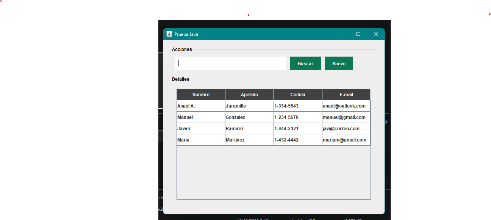
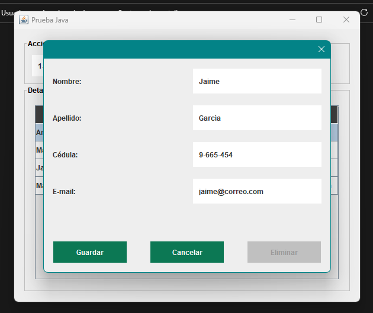
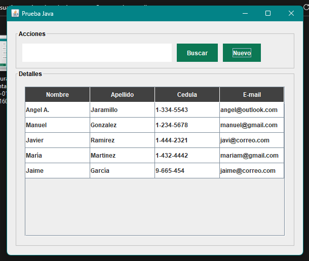
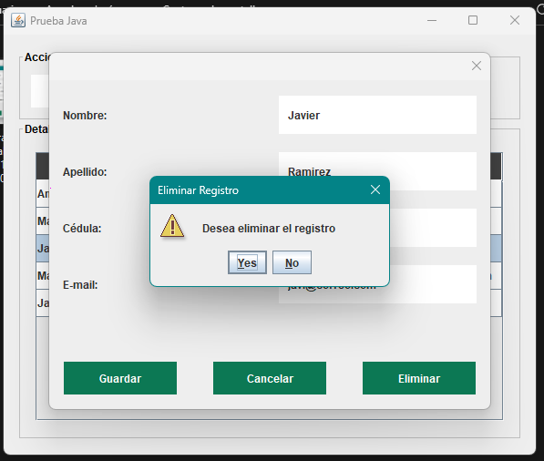
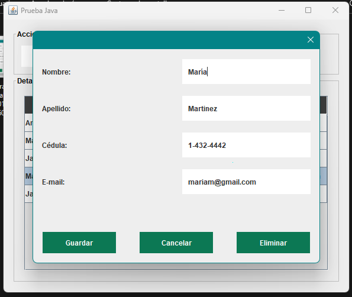
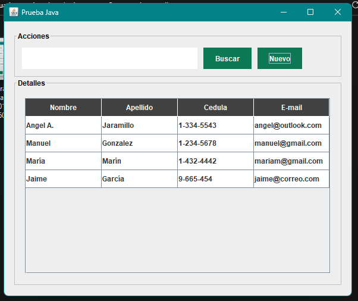
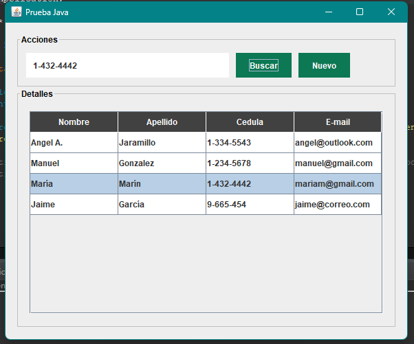

# Aplicación CRUD con Java y MySQL

Aplicación con funciones de insertar, eliminar, editar y buscar usuarios.

## Insertar
Presione el boton Nuevo en cual abrira una ventana modal y llene los campos con la información solicitada luego presione guardar.

## Eliminar
Presione 2 veces sobre la fila de la tabla con la información del usuario que desea eliminar se abrira la ventana modal luego presione eliminar y confirme la operación.

## Editar
Al igual que eliminar presione 2 veces sobre la fila con el usuario a editar, se abrira la ventana modal; edite los campos y luego presine guardar.

## Buscar
Ingrese el número de cédula completo del usuario a buscar y luego presione buscar, la fila con la información del usuario de resaltara para indicar que el usuario existe en el registro.

